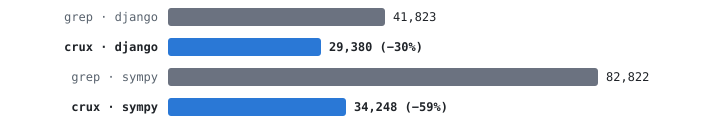
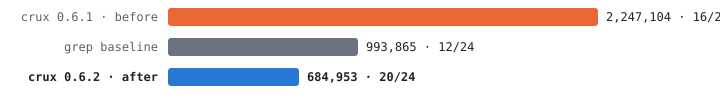

# crux

**In benchmarked coding sessions, crux makes an agent right 9 times out of 10 — and cuts the cost of each correct answer almost in half.**

| Session benchmark (48 questions, Codex CLI) | grep only | with crux |
| --- | --- | --- |
| Correct answers | 28/48 (58%) | **43/48 (90%)** |
| Tokens per correct answer | 59,394 | **31,644 (−47%)** |
| On SymPy (770k lines) | 82,822 | **34,248 (−59%)** |

<picture>
  <source media="(prefers-color-scheme: dark)" srcset="doc/bench-tokens-per-correct-dark.svg">
  
</picture>

The larger the codebase, the larger the gain. Full data: [results post](https://halv.ai/blog/crux-sessions) and [methodology deep-dive](https://halv.ai/blog/crux-sessions-deep-dive).

## What crux is

crux is an MCP server for AI coding agents. It reads a [SCIP](https://github.com/sourcegraph/scip) index of your code. It answers these questions in compact text:

- Where is this symbol?
- Who uses this symbol?
- Who calls this function?
- Which exports are not used?

The agent does not read full files to find these answers. Thus the agent uses fewer tokens.

In session-shaped Codex CLI benchmarks, crux raised correct answers from 58% to 90%. Tokens per correct answer fell by 47%. On the hardest repository, they fell by 59%. The [Benchmark](#benchmark) section has details.

## Installation

Download the binary for your platform from [GitHub Releases](https://github.com/pedr0v/crux/releases):

| Platform | Binary |
| --- | --- |
| macOS (Apple Silicon) | `crux-aarch64-apple-darwin` |
| macOS (Intel) | `crux-x86_64-apple-darwin` |
| Linux (x86_64) | `crux-x86_64-unknown-linux-gnu` |
| Linux (ARM64) | `crux-aarch64-unknown-linux-gnu` |
| Windows (x86_64) | `crux-x86_64-pc-windows-msvc.exe` |

As an alternative, build crux from source:

```sh
cargo install --git https://github.com/pedr0v/crux
```

## Updates

Run `crux self-update` to install the latest standalone version.
Run `crux self-update --check` to check for an update without an installation.
Halv updates its bundled crux through the app updater.

## Setup

### Codex CLI

Run this command:

```sh
crux setup codex
```

This command registers the MCP server in `~/.codex/config.toml`. It also installs a guidance note in `~/.codex/AGENTS.md`.

Use a project note instead of the global note when needed:

```sh
crux setup codex --project /path/to/project
```

This command writes the note to the project's `AGENTS.md`. The MCP registration remains global.

The prompt-space note is required because Codex CLI ignored MCP server instructions alone: 0 organic adoptions in 60 sessions across three wording variants.

### Claude Code

Run this command:

```sh
crux setup claude
```

This command registers the MCP server through the Claude Code CLI. It also installs a guidance note in `~/.claude/CLAUDE.md`.

Pass `--project /path/to/project` to write the note to the project's `CLAUDE.md` instead. The MCP registration remains in user scope.

For files that crux changes, it adds marker-delimited blocks and creates a `<file>.crux-backup` before the first edit. The matching `unsetup` command removes the registration and note byte-clean.

Run `crux unsetup codex` or `crux unsetup claude` to reverse the corresponding setup. Repeat the `--project` option when setup used it.

The agent creates the index automatically on first use. The first query in a large project takes longer because it builds the index.

<details>
<summary>Manual setup</summary>

### Claude Code

Run this command:

```sh
claude mcp add --scope user crux -- /path/to/crux
```

Use `--scope user`. This scope makes crux available in every directory. Without the flag, Claude Code uses the `local` scope.

### Codex CLI

Add these lines to `~/.codex/config.toml`:

```toml
[mcp_servers.crux]
command = "/path/to/crux"
```

This file is global. Codex reads it in every directory, so no scope flag is necessary. Manual registration does not install the required guidance note.

Run `crux setup codex` once to install that note. Crux leaves an existing manual MCP registration unchanged.

</details>

## Profiles

Use `--profile slim|full` to select the tool surface. The `slim` profile is the default and advertises five tools, including `scip_expand`.

Call `scip_expand` to reveal five narrow tools during a slim session. The `full` profile advertises all ten tools from the start.

For example:

```sh
crux --profile full
```

You can also set `CRUX_PROFILE=full`. The `--profile` flag overrides the environment variable. In the full profile, `scip_expand` returns `already expanded`.

## Tools

| Tool | Function |
| --- | --- |
| `scip_index` | Finds the project language. Creates or refreshes the SCIP index. |
| `scip_find` | Finds symbol candidates by name. It can find unreferenced symbols. |
| `scip_map` | Shows definitions, signatures, reference sites, and callers for a maximum of eight symbol names. |
| `scip_outline` | Shows the definition structure of one file. |
| `scip_expand` | Adds the narrow tools to a slim server session. |

The `full` profile and `scip_expand` add these narrow tools:

| Tool | Function |
| --- | --- |
| `scip_search` | Finds symbols by name. Shows compact matches. |
| `scip_def` | Shows definitions with signatures, documentation, and source lines. |
| `scip_refs` | Shows reference lines for one symbol, in groups by file. |
| `scip_callers` | Shows the direct or transitive callers of one function. |
| `scip_dead` | Shows exports with no references in other files. Use it before you delete code. |

## Migration from 0.5.x

Version 0.6.0 uses the four consolidated tools by default. The narrow tools remain available through `scip_expand` or the `full` profile.

| Old 0.5.x call | New 0.6.0 call |
| --- | --- |
| `scip_index { project_root, language?, max_file_mb? }` | Unchanged. |
| `scip_search { project_root, query, limit? }` | `scip_find { project_root, name: query, limit? }` |
| `scip_def { project_root, name }` | `scip_map { project_root, names: [name] }` |
| `scip_refs { project_root, name, limit? }` | `scip_map { project_root, names: [name], ref_limit: limit? }` |
| `scip_callers { project_root, name, depth?, limit? }` | `scip_map { project_root, names: [name], ref_limit: limit? }` |
| `scip_dead { project_root, path_prefix?, limit?, exports_only? }` | `scip_find { project_root, name: "*", unreferenced: true, limit? }` |
| `scip_map { project_root, names, refs_limit? }` | `scip_map { project_root, names, ref_limit? }` |
| `scip_outline { project_root, file }` | Unchanged. |

`scip_map` no longer accepts `context` or `include_imports`.
The new map filters import and re-export sites.
It reports direct callers and has no caller depth option.
The unreferenced query has no path or export filter.

## Language support

| Language | Indexer | Requirement |
| --- | --- | --- |
| TypeScript / JavaScript | `scip-typescript` through `npx` | Install Node.js. |
| Python | `scip-python` through `npx` | Install Node.js version 22 or lower. For large vendored directories, add an exclude list to `pyrightconfig.json`. |
| Rust | `rust-analyzer scip` | Run `rustup component add rust-analyzer`. |
| Dart / Flutter | `scip_dart` | Run `dart pub global activate scip_dart`. |
| Java / Kotlin | `scip-java` | Install [Coursier](https://get-coursier.io/). |
| C / C++ | `scip-clang` | Supply a `compile_commands.json` compilation database. |

crux writes the index to `<project>/.scip-nav/index.scip`. Add `.scip-nav/` to your global gitignore file.

## Benchmark

The repositories were Django (2,572 files / 344k lines) and SymPy (1,555 files / 770k lines). All runs used paired, token-metered Codex CLI sessions with identical questions and scoring.

### Sessions (crux 0.6.2)

Six navigation questions per continuous session, four sessions per repository. This is the realistic setup: the index loads once and every question after it rides free.

| Repository | Correct (grep) | Correct (crux) | Tokens per correct answer |
| --- | --- | --- | --- |
| Django | 16/24 (67%) | **23/24 (96%)** | 29,380 vs 41,823 (**−30%**) |
| SymPy | 12/24 (50%) | **20/24 (83%)** | 34,248 vs 82,822 (**−59%**) |

<picture>
  <source media="(prefers-color-scheme: dark)" srcset="doc/bench-sympy-before-after-dark.svg">
  
</picture>

Version 0.6.2 reshaped the query results for large repositories. The chart shows the effect on SymPy: 3.3× fewer tokens than 0.6.1, below the grep baseline, with more correct answers.

Every crux session ran 13–14 turns with exactly 4 index calls. By question six, the premium over grep is +0.3%. One SymPy session scored 6/6 for 169,693 tokens — a perfect session on a 770k-line repository, cheaper than an average wrong-answer grep session.

Read the [results post](https://halv.ai/blog/crux-sessions) and the [methodology deep-dive](https://halv.ai/blog/crux-sessions-deep-dive).

### Single questions (crux 0.6)

50 verifiable navigation questions, one per fresh session — the hardest setup for crux, because every answer pays the full setup cost alone.

| Metric | grep only | with crux |
| --- | --- | --- |
| Correct answers | 33/50 (66%) | 48/50 (96%) |
| Tokens per correct answer | 93,832 | 71,159 (-24%) |
| Tokens wasted on wrong answers | 35% of spend | 5% of spend |

On definition lookups, the agent skips the index (0 calls, cost parity); the gains come from callers and reference questions.

Read the [accessible post](https://halv.ai/blog/crux-benchmark) and the [methodology deep-dive](https://halv.ai/blog/crux-benchmark-deep-dive).

## crux and Halv

crux has the MIT license. crux is fully local. It operates on one repository in one session. All operations occur on your machine. crux sends no telemetry.

[Halv](https://halv.ai) includes crux. Halv adds these functions: cache between sessions, measurement of saved tokens, multi-repository indexes, and hosted indexes for teams.
